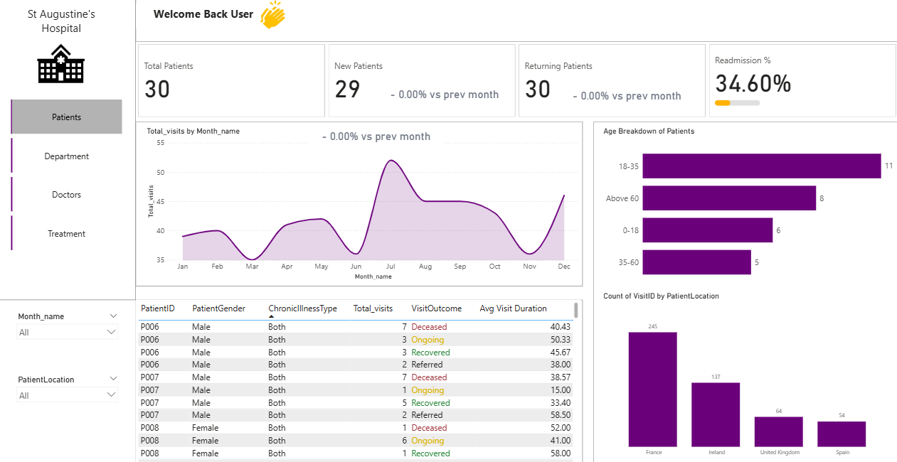
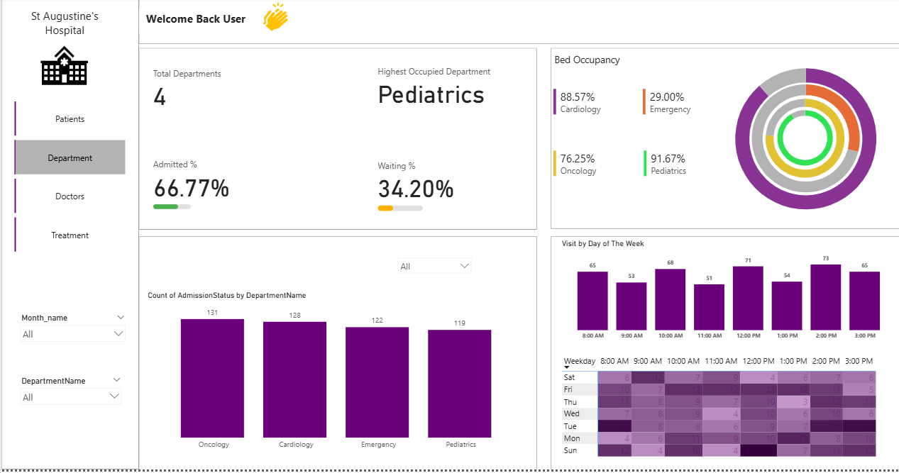
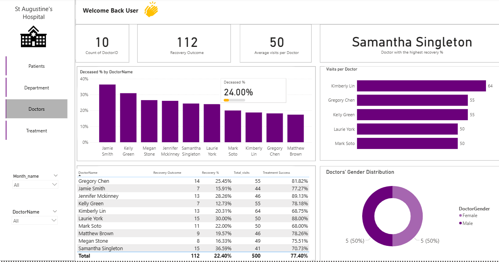
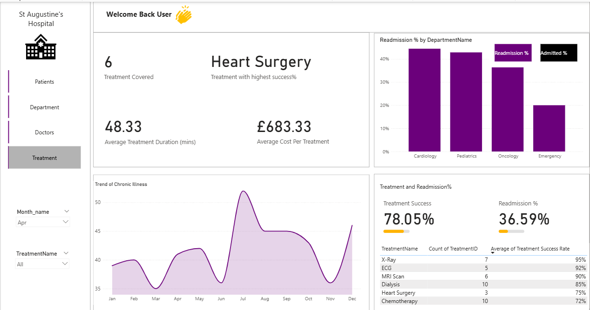
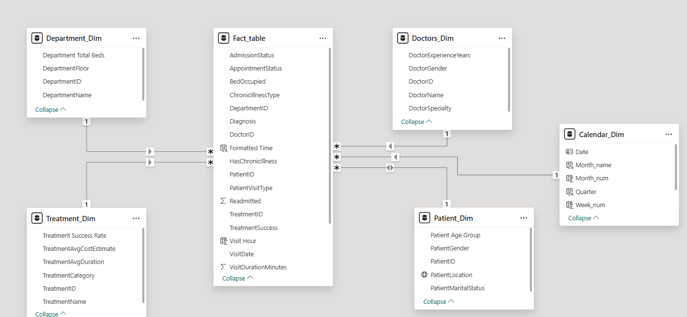

## Healthcare Operations & Patient Analytics Solutions – St. Augustine Hospital

## Project Description

This project delivers an end-to-end healthcare analytics solution designed to improve visibility into hospital operations and patient outcomes. It transforms raw, unstructured data into a scalable star schema model and presents key insights through an interactive Power BI dashboard.

The solution enables stakeholders to monitor critical metrics such as patient flow, treatment effectiveness, departmental capacity, and workforce performance, supporting more informed and data-driven decision-making.

---
## Overview
St. Augustine Hospital relied on a flat-file data structure, limiting its ability to analyse operational performance and identify trends.

To address this, the data was restructured into a star schema model, improving data quality, performance, and analytical flexibility. This foundation was then used to develop interactive dashboards with key KPIs and drill-down capabilities.

The analysis highlighted key challenges, including high readmission rates, capacity pressure in high-demand departments, and uneven workload distribution across doctors. These insights provide a basis for targeted improvements in resource allocation, patient care, and operational planning.

---
## Project Rationale
The hospital’s reliance on a flat-file data structure created significant limitations in its ability to generate timely, accurate, and actionable insights. Data redundancy, poor performance, and the lack of clear relationships between key entities (patients, doctors, departments, and treatments) made it difficult to analyse trends or monitor operational performance effectively.

As a result, stakeholders had limited visibility into critical areas such as patient demand patterns, departmental workload, treatment outcomes, and readmission rates. This constrained both day-to-day operational decisions and longer-term strategic planning.

This project was initiated to address these challenges by introducing a structured data model and an interactive analytics layer. By implementing a star schema and developing a Power BI dashboard, the solution enables efficient data exploration, real-time KPI monitoring, and multi-dimensional analysis.

Ultimately, the rationale is to transition from static, reactive reporting to a more proactive, insight-driven approach, empowering stakeholders to optimise resource allocation, improve patient care, and enhance overall hospital performance.

---
## Aim of the Project 
The aim of this project is to design a scalable analytics solution that provides clear visibility into hospital operations, patient outcomes, and resource utilisation. By transforming raw data into structured insights, the project supports data-driven decision-making to improve efficiency, optimise performance, and enhance quality of care.
 
---
## Key Business Questions 
The dashboard was designed to address the following core business questions, enabling stakeholders to gain deeper insight into hospital operations, patient behaviour, and treatment outcomes:
- How do patient visits trend month by month across the year?
- What is the age group distribution of patients?
- From which locations/cities are patients visiting the hospital?
- What percentage of cases are currently waiting vs admitted?
- Which department is the most occupied overall
- What is the admission status breakdown per department?
- On which days of the week and times do most patient visits occur?
- How are visits distributed among doctors (workload)
- For each doctor, what are the details of recovery outcomes, success rates, and average visits?
- How many treatment types are offered by the hospital?
- How does treatment success rate differ by department
- What is the trend of chronic illness cases over time?

---

## Project Scope (Step by Step Approach)
The project was executed through a structured and methodical approach, ensuring both data integrity and analytical value:
### 1. Data Acquisition & Understanding
Imported the hospital dataset into Power BI and performed an initial assessment to understand data structure, key fields, and business relevance.
### 2. Data Preparation & Transformation
Cleaned and standardised the dataset by handling missing values, correcting data types, and removing inconsistencies to ensure reliability for analysis.
### 3. Data Modelling
Designed and implemented a star schema by separating transactional data from descriptive attributes, and established relationships to enable efficient querying and filtering.
### 4. KPI Definition & Measure Development
Developed key business metrics using DAX, including patient counts, admission rates, treatment success rates, readmissions, and visit durations.
### 5. Exploratory Data Analysis
Analysed trends and patterns across time, departments, doctors, and patient demographics to uncover meaningful insights.
### 6. Dashboard Design & Visualisation
Built interactive dashboards with clear layouts, incorporating charts, KPIs, and slicers to allow users to explore data dynamically.
### 7. Insight Generation & Interpretation
Translated analytical findings into actionable insights, focusing on operational efficiency, patient outcomes, and resource utilisation.
### 8. Business Recommendations
Provided data-driven recommendations to support decision-making, including improvements in capacity planning, workforce allocation, and patient care strategies.

## Project Images
### 1. Patients Analysis

### 2. Department Analysis

### 3. Doctors Analysis

### 4. Treatment Analysis

### 5. Data Model (Star Schema)

---
## Interactive Power BI Dashboard
Click below to explore the live dashboard

[Dashboard](./Pbix/Health_care.pbix)

---
## Dataset
[Find the Dataset here](./Dataset/St.%20Augustine's%20Hospital%20Visits.csv)

---
## Key Insights
The analysis uncovered several critical insights across hospital operations, patient behaviour, and treatment outcomes:
### 1. Quality of Care
- The hospital exhibits a high readmission rate (~35%), particularly within Cardiology and Pediatrics.
- This suggests potential gaps in post-discharge care, treatment effectiveness, or patient follow-up processes, requiring immediate attention.
### 2. Department Capacity & Utilisation
- Pediatrics is operating near full capacity (~91%), indicating significant pressure on resources and potential risk of service bottlenecks.
- In contrast, the Emergency department is underutilised (~29%), highlighting inefficiencies in patient allocation and resource distribution.
### 3. Workforce & Performance
- Patient visits are unevenly distributed across doctors, with certain practitioners handling significantly higher workloads.
- There is also variation in patient outcomes across doctors, suggesting opportunities for performance standardisation and knowledge sharing.
### 4. Treatment Effectiveness
- Overall treatment success rate is approximately 78%, indicating generally strong performance.
- However, success rates vary significantly:
  - Higher for routine procedures (e.g., diagnostics)
  - Lower for complex treatments (e.g., surgeries, oncology-related care)
### 5. Patient Demographics & Geography
- The majority of patients fall within the 18–35 age group, with a secondary concentration in older populations (60+).
- Patient inflow is geographically concentrated, indicating reliance on specific regions and potential opportunities for expansion.
### 6. Chronic Illness Trends
- Chronic illness cases show consistent and increasing patterns over time, with noticeable spikes during peak periods.
- This suggests a growing long-term burden on hospital resources and highlights the need for preventive and continuous care strategies.

---
## Strategic Recommendation
### 1. Improve Readmission Rates
**Recommendation:** Strengthen post-discharge care and patient follow-up processes.

**Action:**
- Introduce structured follow-up programmes (calls, check-ins within 7–30 days)
- Implement discharge planning protocols for high-risk patients
- Use data to flag patients with high likelihood of readmission
### 2. Optimise Department Capacity
**Recommendation:** Address capacity pressure in high-demand departments and improve utilisation of underused units.

**Action:**

- Increase bed capacity and staffing in Pediatrics
- Redirect non-critical cases to underutilised departments (e.g., Emergency)
- Implement real-time bed and resource tracking dashboards
### 3. Balance Workforce Distribution
**Recommendation:** Ensure equitable workload distribution across medical staff to improve efficiency and outcomes.

**Action:**

- Introduce workload balancing systems based on patient volume
- Monitor doctor performance metrics regularly
- Share best practices from high-performing doctors
## 4. Enhance Treatment Effectiveness
**Recommendation:** Improve outcomes for complex and high-risk treatments.

**Action:**

- Review treatment protocols for lower-performing procedures
- Invest in specialised training and equipment
- Track treatment performance continuously using KPIs
## 5. Expand Patient Reach 
**Recommendation:** Reduce dependency on a single geographic region and broaden patient base.

**Action:**

- Develop outreach programmes in underrepresented regions
- Partner with local clinics and referral networks
- Use targeted awareness campaigns to attract new patients
## 6. Strengthen Chronic Illness Management
**Recommendation:** Shift towards preventive and long-term care strategies for chronic conditions.

**Action:**

- Implement chronic disease management programmes
- Schedule regular monitoring and follow-up appointments
- Educate patients on early intervention and lifestyle management

